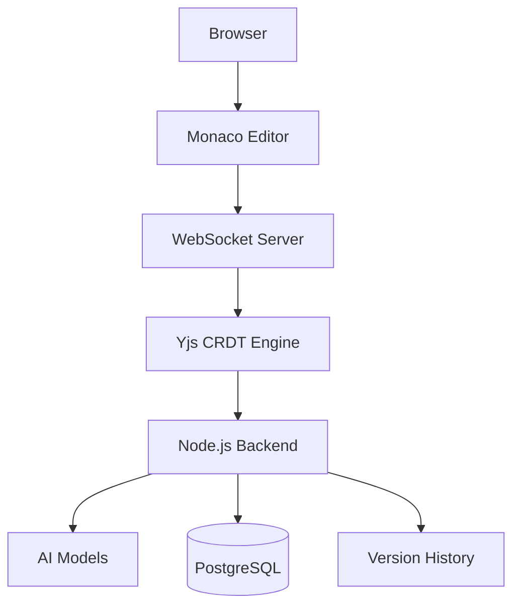

# **ochre.**

*build software without friction*

 

A collaborative software development workspace that unifies real-time coding, intelligent assistance, and continuous version history into a single platform.

 

Built for the **ShePreneur Startup Bootcamp 2026**.

[Overview](#overview) · [Principles](#principles)  · [Features](#features) · [Architecture](#architecture) · [Tech Stack](#tech-stack) · [Getting Started](#getting-started)  · [Prerequisites](#prerequisites) · [Installation](#installation) · [Environment Variables](#environment-variables) · [Project Structure](#project-structure) · [Roadmap](#roadmap) · [Upcoming Features](#upcoming-features)

 

## Overview

Software development today is fragmented. Building a single feature often requires switching between a code editor, GitHub, an AI assistant, a messaging app, and other tools — and none of them share context with each other.

This is why we built **Ochre**. Now, developers can:

-    write code at the same time
-    see teammates' cursors, selections and updates
-    restore any previous version instantly
-    search through their code quickly

> Instead of stitching tools together, Ochre treats the editor itself as the collaboration layer.

 

## Principles

-  **O**rchestrate:  one workspace for every workflow
-  **C**ollaborate:  teams stay in sync every step of the way
-  **H**armonise:  every tool works as one
-  **R**eason:  intelligence that understands context
- **E**ngineer:  every build, engineered for production

 

## Architecture

Real-time sync is powered by **Yjs**, a CRDT (Conflict-free Replicated Data Type) engine, so concurrent edits merge automatically without manual conflict resolution. The Node.js backend coordinates AI requests, persistence, and version history alongside the live collaboration layer.

 

## Features

| Feature | Description |
|---|---|
| 👥 **Real-Time Collaboration** | Multiple developers edit the same project simultaneously, with live cursors, live selections, and instant sync. |
| 🤖 **AI Pair Programmer** | Built-in AI assists with code generation, debugging, refactoring, code explanations, documentation, and architecture guidance. |
| 📝 **Continuous Version History** | Every change is preserved automatically — restore previous versions, compare edits, and track project evolution without relying solely on commits. |
| ⚡ **Live Developer Presence** | See who's online, where they're editing, and what files they're working on, without interrupting anyone's flow. |
| 📁 **Unified Workspace** | Code, AI, collaboration, history, and project management all live in a single place. |

 

## Tech Stack

| Layer | Technology |
|---|---|
| Frontend | React 19 + TypeScript |
| Editor | Monaco Editor |
| Styling | Tailwind CSS |
| Backend | Node.js + Express |
| Real-time Collaboration | WebSockets + Yjs (CRDT) |
| Database | PostgreSQL |
| Authentication | Custom — pbkdf2 password hashing + base64 JWT |

 

*Built with ❤️ by team PromptShop.*
