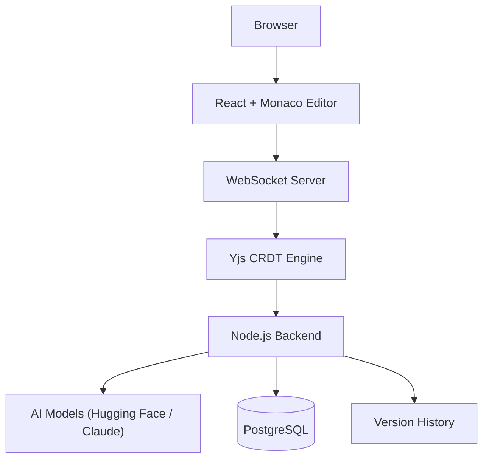

<div align="center">


# **ochre.**

*build software without friction*

<div align="center">

</br>

An AI-native collaborative software development workspace that unifies real-time coding, intelligent assistance, and continuous version history into a single platform.

</br>

Built for the **ShePreneur Startup Bootcamp 2026**.

[Overview](#overview) · [Why Ochre](#why-ochre)  · [Features](#features) · [Architecture](#architecture) · [Tech Stack](#tech-stack) · [Getting Started](#getting-started)  · [Prerequisites](#prerequisites) · [Installation](#installation) · [Environment Variables](#environment-variables) · [Project Structure](#project-structure) · [Roadmap](#roadmap) · [Contributing](#contributing) · [Team](#team) · [License](#license)

---

## Overview

Software development today is fragmented. A single feature often requires switching between a code editor, GitHub, an AI assistant, a messaging app, and separate documentation tools — and none of them share context with each other.

**Ochre** is an AI-powered collaborative development platform that brings all of it into one workspace. Developers can:

- Collaborate in real time, in the same file, at the same time
- Get intelligent AI assistance without leaving the editor
- See teammates' cursors, selections, and active files live
- Restore any previous version instantly
- Stay synchronized throughout the entire development lifecycle

> Instead of stitching tools together, Ochre treats the editor itself as the collaboration layer.

---

## Why Ochre

**The current workflow:**

```
VS Code → GitHub → Slack → AI Chat → Documentation → Terminal → back to VS Code
```

**The Ochre workflow:**

```
Code → Collaborate → Reason → Build → Ship
```

All inside one workspace — no context-switching, no waiting on commits and pulls to see a teammate's changes, no losing track of who did what.

---

## Features

| Feature | Description |
|---|---|
| 👥 **Real-Time Collaboration** | Multiple developers edit the same project simultaneously, with live cursors, live selections, and instant sync. |
| 🤖 **AI Pair Programmer** | Built-in AI assists with code generation, debugging, refactoring, code explanations, documentation, and architecture guidance. |
| 📝 **Continuous Version History** | Every change is preserved automatically — restore previous versions, compare edits, and track project evolution without relying solely on commits. |
| ⚡ **Live Developer Presence** | See who's online, where they're editing, and what files they're working on, without interrupting anyone's flow. |
| 📁 **Unified Workspace** | Code, AI, collaboration, history, and project management all live in a single place. |

---

## Architecture



Real-time sync is powered by **Yjs**, a CRDT (Conflict-free Replicated Data Type) engine, so concurrent edits merge automatically without manual conflict resolution. The Node.js backend coordinates AI requests, persistence, and version history alongside the live collaboration layer.

---

## Tech Stack

| Layer | Technology |
|---|---|
| Frontend | React + TypeScript |
| Editor | Monaco Editor |
| Styling | Tailwind CSS |
| Backend | Node.js + Express |
| Real-time collaboration | WebSockets + Yjs (CRDT) |
| Database | PostgreSQL |
| ORM | Prisma |
| Authentication | Clerk / Auth.js |
| AI | Hugging Face + Claude |
| Deployment | Vercel (frontend) + Railway (backend) |

---

## Getting Started

### Prerequisites

- [Node.js](https://nodejs.org/) v18 or later
- [npm](https://www.npmjs.com/)
- A [PostgreSQL](https://www.postgresql.org/) instance (local or hosted)

### Installation

**1. Clone the repository**

```bash
git clone https://github.com/yourusername/ochre.git
cd ochre
```

**2. Install and run the frontend**

```bash
cd client
npm install
npm run dev
```

**3. Install and run the backend**

```bash
cd server
npm install
npm run dev
```

The client will be available at `http://localhost:5173` (or whichever port Vite assigns) and the server at the port configured in your backend `.env`.

### Environment Variables

Create a `.env` file in the `server` directory with the following:

```env
# Database
DATABASE_URL=
POSTGRES_URL=

# Auth
JWT_SECRET=

# AI providers
OPENAI_API_KEY=
HUGGINGFACE_API_KEY=
ANTHROPIC_API_KEY=
```

> ⚠️ Never commit your `.env` file. Add it to `.gitignore` and share required keys with collaborators securely.

---

## Project Structure

```
ochre/
├── client/          # React + TypeScript frontend, Monaco Editor integration
├── server/          # Node.js + Express backend, WebSocket + Yjs sync server
├── prisma/          # Database schema and migrations
└── README.md
```

---

## Roadmap

### ✅ MVP
- [x] Monaco Editor integration
- [x] Multi-user real-time editing
- [x] Live cursors
- [x] Authentication
- [x] Version history
- [x] AI chat assistant

### 🚀 Phase 2
- [ ] AI-powered code review
- [ ] Voice collaboration
- [ ] Inline file comments
- [ ] Git integration
- [ ] Shared terminal sessions

### 🌍 Phase 3
- [ ] Enterprise workspaces
- [ ] AI project memory
- [ ] Team analytics dashboard
- [ ] Plugin marketplace
- [ ] Mobile companion app

---

## Contributing

Contributions, issues, and feature requests are welcome.

1. Fork the project
2. Create your feature branch (`git checkout -b feature/amazing-feature`)
3. Commit your changes (`git commit -m 'Add some amazing feature'`)
4. Push to the branch (`git push origin feature/amazing-feature`)
5. Open a Pull Request

---

## Team

Built as part of the **ShePreneur Startup Bootcamp 2026**, with the vision of eliminating collaboration friction and redefining how modern software teams build together.

| Name | Role |
|---|---|
| **Shiloh Faith** | Frontend · AI Integration · Product Design |
| **Swetha Rajesh** | Backend · Real-time Collaboration · Infrastructure |

---

<div align="center">

**Ochre — build software without collaboration friction.**

</div>
